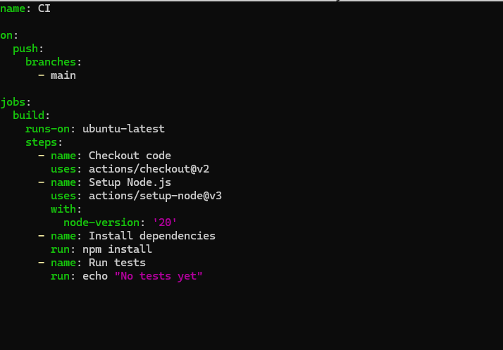
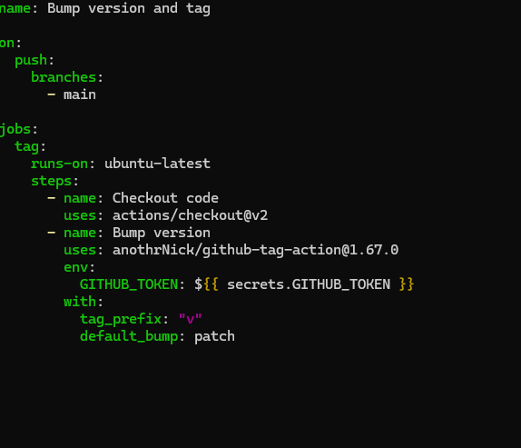
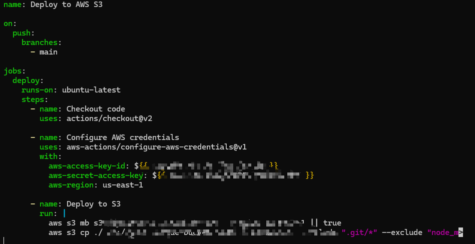
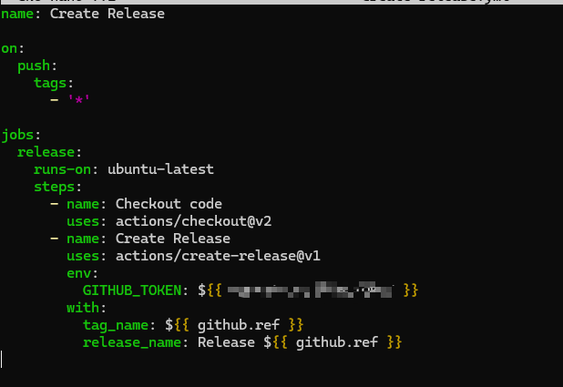

## ✅ CI/CD Pipeline Project with GitHub Actions (Deploy to AWS)

---

### **PHASE 1: Project & Environment Setup**

#### 1.1 Create a GitHub Repository

- Create a new repo (e.g., `ci-cd-aws-deploy`) on GitHub.
- Clone the repo to your local machine:

  ```bash
  git clone https://github.com/your-username/ci-cd-aws-deploy.git
  cd ci-cd-aws-deploy
  ```

#### 1.2 Initialize Node.js App

```bash
npm init -y
echo 'console.log("App deployed via GitHub Actions")' > app.js
```

Push the app:

```bash
git add .
git commit -m "Initial commit"
git push origin main
```

#### 1.3 Setup AWS CLI & IAM

- Create an IAM user with programmatic access.
- Attach `AmazonS3FullAccess` or appropriate policy.
- Save `AWS_ACCESS_KEY_ID` and `AWS_SECRET_ACCESS_KEY`.

#### 1.4 Add GitHub Secrets

- Go to **Settings → Secrets and variables → Actions** in your GitHub repo.
- Add:
  - `AWS_ACCESS_KEY_ID`
  - `AWS_SECRET_ACCESS_KEY`

---

### **PHASE 2: CI/CD Workflows**

Your CI/CD pipeline is managed by workflow files in `.github/workflows/`:

- **Continuous Integration:** `.github/workflows/ci.yml`
- **Version Bumping:** `.github/workflows/bump-version.yml`
- **AWS Deployment:** `.github/workflows/deploy-to-aws.yml`
- **Release Creation:** `.github/workflows/create-release.yml`

> For workflow details, check the respective files in the repository.

#### 📸 Screenshots

- CI Workflow Example  
  

- Version Bump Workflow  
  

- AWS Deployment Workflow  
  

- Release Creation Workflow  
  

---

### **PHASE 3: Final Steps & Validation**

#### ✅ Test Everything

1. Push to `main` → triggers CI, bumps version, deploys to AWS S3.
2. Push a tag (e.g., `v1.0.0`) → triggers GitHub Release.
3. Confirm:
   - CI runs successfully.
   - Deployment uploads to S3.
   - Version is tagged.
   - Release appears on GitHub.

---

### 📁 Folder Structure

```
.
├── .github/workflows/
│   ├── ci.yml
│   ├── bump-version.yml
│   ├── deploy-to-aws.yml
│   └── create-release.yml
├── app.js
├── package.json
├── README.md
└── img/
```

---

**For workflow code, see the files in `.github/workflows/`. Screenshots above show the setup and results from the terminal.**
---

## 🏁 Conclusion

This project demonstrates a complete CI/CD pipeline using GitHub Actions to automate building, versioning, and deploying a Node.js application to AWS S3. By leveraging workflow files and GitHub secrets, every code change is automatically tested and deployed, ensuring reliability and speed. The included screenshots and folder structure illustrate the setup and successful execution of each workflow phase. This approach streamlines development and release processes, making cloud deployments